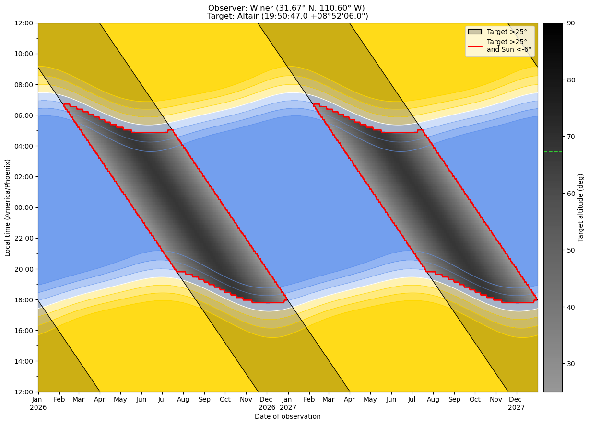
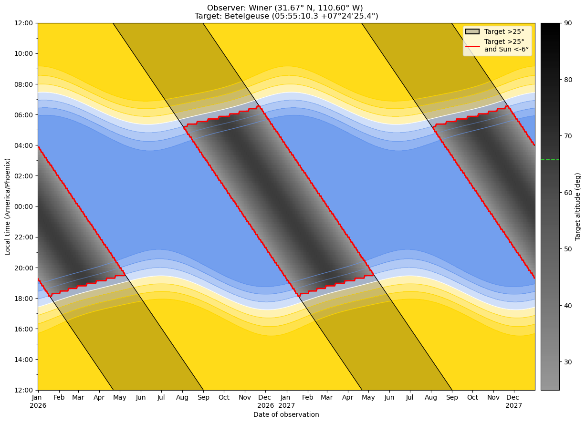
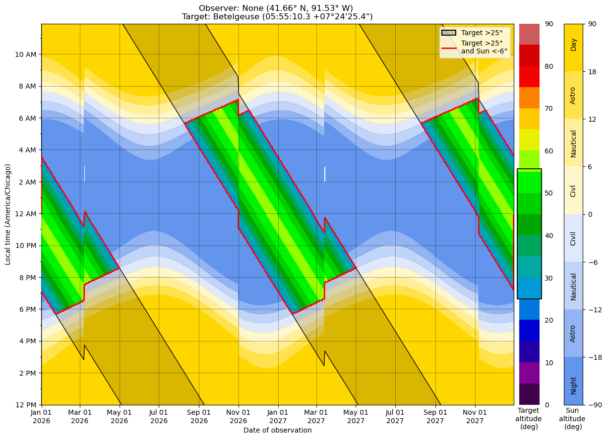
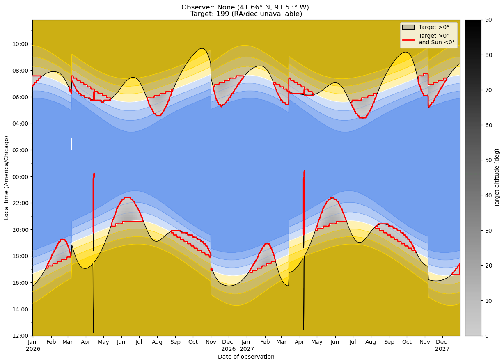
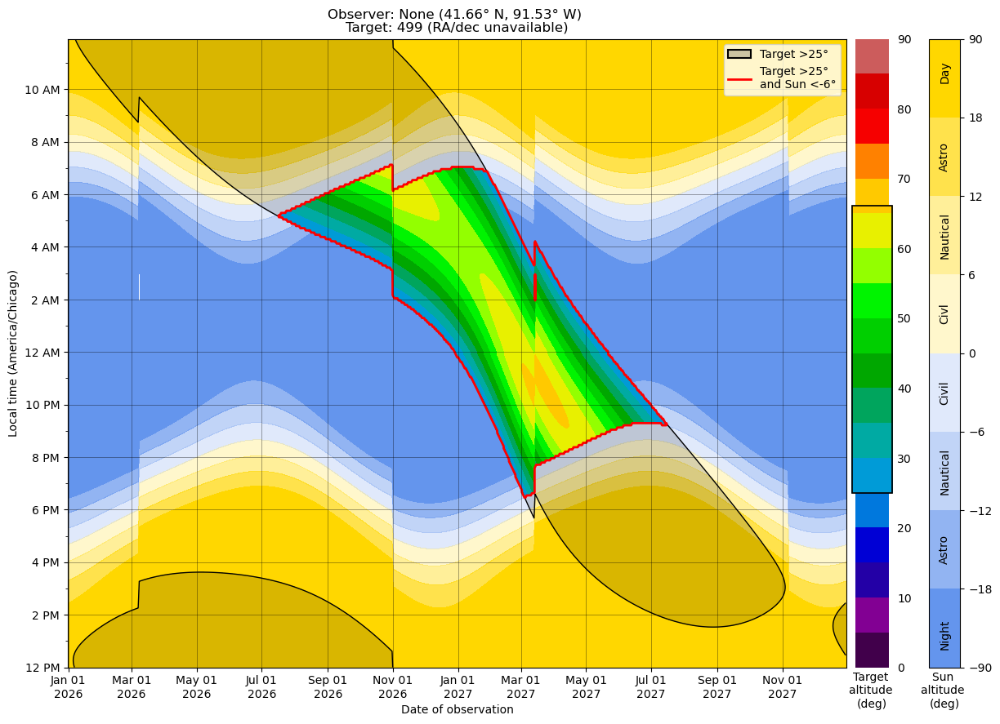

# Visibility Planner

## Overview

Visibility Planner is a tool for computing and visualizing when astronomical targets are observable from a given location. It generates visibility maps with time of year on the x-axis and local time on the y-axis, making it easy to see when a target is accessible throughout the night and throughout the year.

The plots highlights when a target is observable by looking for times when both conditions are met: 
- the target is above a chosen minimum altitude, and
- the Sun is below a chosen twilight threshold. 

The tool is intended for amateur astronomers, professional astronomers, observatories, and anyone planning astronomical observations. To use the tool directly in your browser, open the Marimo notebook here: https://molab.marimo.io/notebooks/nb_eDD1CyUATZa7W4bCjfUecS/app 

### Why use this tool? 

This tool provides a fast and intuitive way to identify optimal observing windows without manually checking ephemerides night by night. Traditional visibility tools are often designed around examining a single date at a time (for example, plotting altitude versus time over the course of one night). While useful for planning an individual observing session, that approach becomes cumbersome when trying to answer questions about long-term observability. 

For many observing projects, the important question is not simply “Where is the target at 10:30 PM on this date?” but rather “During which parts of the year is this target observable at any point during the night?” A target may be equally acceptable at 10 PM, 2 AM, or just before dawn, as long as it rises high enough above the horizon under sufficiently dark skies at some point throughout the night. 

Visibility Planner addresses this by displaying altitude as a function of both date and local time simultaneously. Instead of viewing one night at a time or a fixed clock time across the year, the plots show the full evolution of a target’s visibility throughout the year in a single visualization. This makes it easy to identify:

- when a target first becomes observable each season,
- how long it remains observable,
- what times of night it is best placed throughout the season,
- how twilight and seasonal night length affect observing opportunities.

Tools such as Telescopius and Stellarium are excellent for exploring the sky and planning individual observing sessions, but they are generally optimized around specific dates and times selected by the user. Visibility Planner instead emphasizes the global structure of observability across both time-of-night and time-of-year, making long-term planning and campaign scheduling much more intuitive.

---

## Example Plots 

Here, we provide several example plots generated with this tool in order to show how it can be used. 

### 1. Visibility of a target from Winer Observatory

This plot shows the visibility window for a target as seen from Winer Observatory in Arizona. The highlighted regions indicate when the target is both above the minimum altitude and the sky is dark enough to observe. 

---

### 2. Changing the target (different RA/Dec)

Here we select a different target. Because it has a different right ascension and declination, its visibility shifts to different times of the year compared to the first example.

---

### 3. Changing the observer location

In this example, we change the observing location. Several effects are visible:

* The local time axis now reflects **daylight savings time**, unlike the first location
* The target is **visible for a shorter duration**
* **Nighttime is shorter in the summer**, since this location is farther from the equator

---

### 4. Moving targets (planets and asteroids) 

This tool can also be used to track moving targets (i.e., targets that change their RA and dec over time), such as planets, asteroids, and comets. 

The first example shows the planet Mercury. Because Mercury is the closest planet to the sun, it can only ever be seen just after sunset or just before sunrise. This plot shows the best times of year to view Mercury from a given observer location. 

(Note: the plot title gives the target as "199" rather than "Mercury". This is because 199 is the ID assigned to Mercury by the JPL Horizons database, which was used to calculate the RA and dec of moving targets.) 

Second, we show the planet Mars. Mars has an orbital period of nearly two years, meaning that the time of year it is visible drifts over this time frame. (Note: 499 is the JPL Horizons ID for the planet Mars.) 

---
## Summary

Visibility Planner is designed to make long-term observation planning fast, visual, and intuitive. Instead of searching through nightly rise/set tables or manually checking observing software date by date, the visibility maps provide an immediate overview of when a target is observable, how high it will appear in the sky, and how observing conditions change throughout the year. Whether you are scheduling observations for research, planning astrophotography targets for the coming season, or simply exploring what is visible from your location, Visibility Planner provides a convenient way to understand the yearly visibility patterns of astronomical targets.
